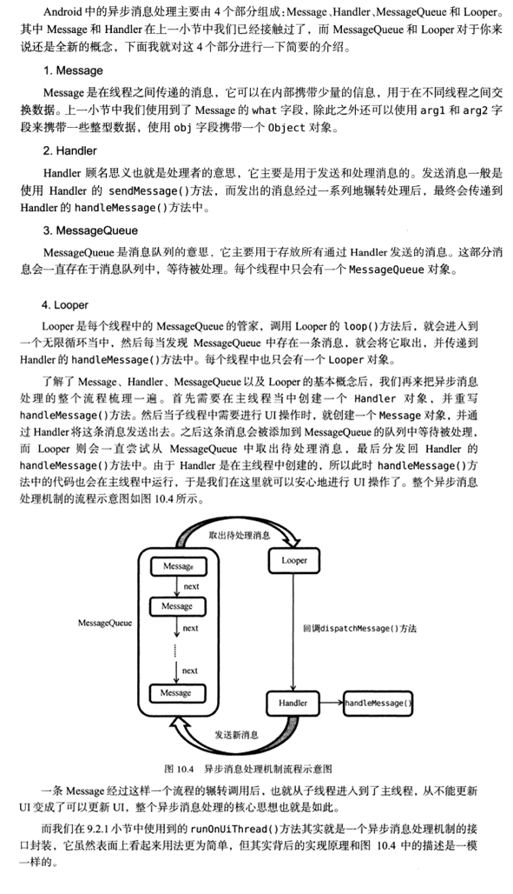

### 一、Andriod 中的异步消息处理主要由四个部分组成，Message、Handler、MessageQueue和Looper.

#### 1.Message:

Message是在线程之间传递的消息，它可以在内部携带少量的信息，用于在不同线程之间交换数据。
Message的what、arg1和arg2字段可以携带一些整型数据，使用obj字段可以携带一个Object对象。
这样在大部分情况下，使用者就不需要再做内存分配工作了。虽然Message的构造函数是public的，
但是最好是使用Message.obtain( )或Handler.obtainMessage( )函数来获取Message对象，因为Message的实现中包含了回收再利用的机制，可以提供效率。

#### 2.MessageQueue:

MessageQueue是消息队列的意思，它主要用于存放所有通过Handler发送的消息。
这部分消息会一直存在于消息队列中，等待被处理。每个线程中只会有一个MessageQueue对象

#### 4.Looper:

Looper是每个线程中的MessageQueue的管家，调用Looper的loop()方法后，就会进入到一个无限循环当中，
然后每当发现MessageQueue()中存在一条消息，就会将它去除，并传递到Handler的handleMessage()方法中。每个线程也只会有一个Looper对象。
Looper是线程用来运行消息循环的。线程本身是没有消息循环的，需要在线程中调用perpare函数，然后调用loop去处理消息。在Android中，系统在启动主线程的时候会自动为之建立一个Looper。

建立本线程的Looper：
```
public static final void prepare()
```

运行本线程的Looper：
```
public static final void loop()
```

获取本线程的Looper：
```
public static final Looper myLooper()
```

获取主线程的Looper：
```
public synchronized static final Looper getMainLooper()
```
#### 3.Handler:

Handler顾名思义也就是处理者的意思，它主要是用于发送和处理消息的。
发送消息一般是使用Handler的sendMessage()方法，而发出的消息经过一系列地辗转处理后，最终会传递到Handler的handleMessage()方法

- A、创建Handler：

创建与本地线程相关联的Handler：

```
public Handler()
public Handler(Callback callback)
```

创建与指定线程相关联的Handler：

```
public Handler(Looper looper)
public Handler(Looper looper, Callback callback)
```

- B、创建消息

```
public final Message obtainMessage()
public final Message obtainMessage(int what)
```

```
public final Message obtainMessage(int what, Object obj)
public final Message obtainMessage(int what, int arg1, int arg2)
public final Message obtainMessage(int what, int arg1, int arg2, Object obj)
```

- C、删除消息

删除在消息队列中未处理的消息

```
public final void removeMessages(int what)
public final void removeMessages(int what, Object object)
```

- D、发送消息

```
public final boolean sendMessage(Message msg)
public final boolean sendMessageDelayed(Message msg, long delayMillis)
public final boolean post(Runnable r)
public final boolean postDelayed(Runnable r, long delayMillis)
```

- E、处理消息

在Looper的loop函数中循环取出MessageQueue的接收消息队列中的消息，然后调用Hander的dispatchMessage函数对消息进行处理，
至于如何处理（相应消息）则由用户指定（三个方法，优先级从高到低：Message里面的Callback，
一个实现了Runnable接口的对象，其中run函数做处理工作；Handler里面的mCallback指向的一个实现了Callback接口的对象，
里面的handleMessage进行处理；处理消息 Handler对象对应的类继承并实现了其中handleMessage函数，通过这个实现的handleMessage函数处理消息）。

```
    /**
     * Handle system messages here.
     */
    public void dispatchMessage(Message msg) {
        if (msg.callback != null) {
            handleCallback(msg);
        } else {
            if (mCallback != null) {
                if (mCallback.handleMessage(msg)) {
                    return;
                }
            }
            handleMessage(msg);
        }
    }
```

异步消息处理的整个流程：



首先需要在主线程当中创建一个Handler对象，并重写handleMessage()方法。然后当子线程中需要进行UI操作时，就创建一个Message对象，并通过Handler将这条消息发送出去。之后这条消息会被添加到MessageQueue的队列中等待被处理，而Looper则会一直尝试从MessageQueue中取出待处理消息，最后分发回Handler的handleMessage方法中。由于Handler是在主线程中创建的，所以此时handleMessage()方法中的代码也会在主线程中运行，所以可以安心的进行UI操作。


1、什么是Looper？

Android中的Looper类，是用来封装消息循环和消息队列的一个类，用于在android线程中进行消息处理。

2、怎样工作？

Android中的Looper类，是用来封装消息循环和消息队列的一个类，用于在android线程中进行消息处理。handler其实可以看做是一个工具类，用来向消息队列中插入消息的。

(1) Looper类用来为一个线程开启一个消息循环。     默认情况下android中新诞生的线程是没有开启消息循环的。（主线程除外，主线程系统会自动为其创建Looper对象，开启消息循环。）     Looper对象通过MessageQueue来存放消息和事件。一个线程只能有一个Looper，对应一个MessageQueue。

(2) 通常是通过Handler对象来与Looper进行交互的。Handler可看做是Looper的一个接口，用来向指定的Looper发送消息及定义处理方法。     默认情况下Handler会与其被定义时所在线程的Looper绑定，比如，Handler在主线程中定义，那么它是与主线程的Looper绑定。 mainHandler = new Handler() 等价于new Handler（Looper.myLooper()）. Looper.myLooper()：获取当前进程的looper对象，类似的 Looper.getMainLooper() 用于获取主线程的Looper对象。

(3) 在非主线程中直接new Handler() 会报如下的错误: E/AndroidRuntime( 6173): Uncaught handler: thread Thread-8 exiting due to uncaught exception E/AndroidRuntime( 6173): Java.lang.RuntimeException: Can't create handler inside thread that has not called Looper.prepare() 原因是非主线程中默认没有创建Looper对象，需要先调用Looper.prepare()启用Looper。

(4) Looper.loop()； 让Looper开始工作，从消息队列里取消息，处理消息。

>注意：写在Looper.loop()之后的代码不会被执行，这个函数内部应该是一个循环，当调用mHandler.getLooper().quit()后，loop才会中止，其后的代码才能得以运行。

(5) 基于以上知识，可实现主线程给子线程（非主线程）发送消息。
    把下面例子中的mHandler声明成类成员，在主线程通过mHandler发送消息即可。

>Android官方文档中Looper的介绍： Class used to run a message loop for a thread. Threads by default do not have a message loop associated with them; to create one, call prepare() in the thread that is to run the loop, and then loop() to have it process messages until the loop is stopped.
Most interaction with a message loop is through the Handler class.
This is a typical example of the implementation of a Looper thread, using the separation of prepare() and loop() to create an initial Handler to communicate with the Looper.

[为什么不能再子线程修改UI？](http://www.jianshu.com/p/6cb48a19d8fc)

[Android -- Looper.prepare()和Looper.loop() —深入版](http://blog.csdn.net/heng615975867/article/details/9194219)

[Android Handler 异步消息处理机制 《第一行代码》](http://blog.csdn.net/u012005313/article/details/48630321)


