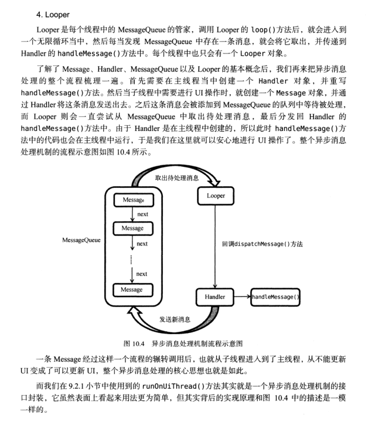

```
    public Handler() {
        this(null, false);
    }

    public Handler(Callback callback) {
        this(callback, false);
    }

    /**
     * Handle system messages here.
     */
    public void dispatchMessage(Message msg) {
        if (msg.callback != null) {
            handleCallback(msg);
        } else {
            if (mCallback != null) {
                if (mCallback.handleMessage(msg)) {
                    return;
                }
            }
            handleMessage(msg);
        }
    }
```

1、什么是Looper？

Android中的Looper类，是用来封装消息循环和消息队列的一个类，用于在android线程中进行消息处理。

2、怎样工作？

Android中的Looper类，是用来封装消息循环和消息队列的一个类，用于在android线程中进行消息处理。handler其实可以看做是一个工具类，用来向消息队列中插入消息的。

(1) Looper类用来为一个线程开启一个消息循环。     默认情况下android中新诞生的线程是没有开启消息循环的。（主线程除外，主线程系统会自动为其创建Looper对象，开启消息循环。）     Looper对象通过MessageQueue来存放消息和事件。一个线程只能有一个Looper，对应一个MessageQueue。

(2) 通常是通过Handler对象来与Looper进行交互的。Handler可看做是Looper的一个接口，用来向指定的Looper发送消息及定义处理方法。     默认情况下Handler会与其被定义时所在线程的Looper绑定，比如，Handler在主线程中定义，那么它是与主线程的Looper绑定。 mainHandler = new Handler() 等价于new Handler（Looper.myLooper()）. Looper.myLooper()：获取当前进程的looper对象，类似的 Looper.getMainLooper() 用于获取主线程的Looper对象。

(3) 在非主线程中直接new Handler() 会报如下的错误: E/AndroidRuntime( 6173): Uncaught handler: thread Thread-8 exiting due to uncaught exception E/AndroidRuntime( 6173): Java.lang.RuntimeException: Can't create handler inside thread that has not called Looper.prepare() 原因是非主线程中默认没有创建Looper对象，需要先调用Looper.prepare()启用Looper。

(4) Looper.loop()； 让Looper开始工作，从消息队列里取消息，处理消息。

>注意：写在Looper.loop()之后的代码不会被执行，这个函数内部应该是一个循环，当调用mHandler.getLooper().quit()后，loop才会中止，其后的代码才能得以运行。

(5) 基于以上知识，可实现主线程给子线程（非主线程）发送消息。
    把下面例子中的mHandler声明成类成员，在主线程通过mHandler发送消息即可。

>Android官方文档中Looper的介绍： Class used to run a message loop for a thread. Threads by default do not have a message loop associated with them; to create one, call prepare() in the thread that is to run the loop, and then loop() to have it process messages until the loop is stopped.
Most interaction with a message loop is through the Handler class.
This is a typical example of the implementation of a Looper thread, using the separation of prepare() and loop() to create an initial Handler to communicate with the Looper.